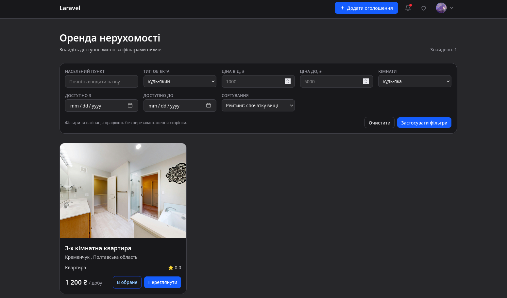
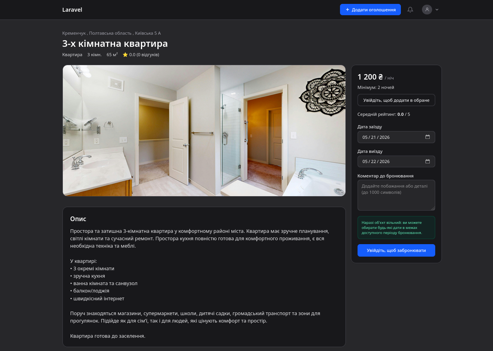
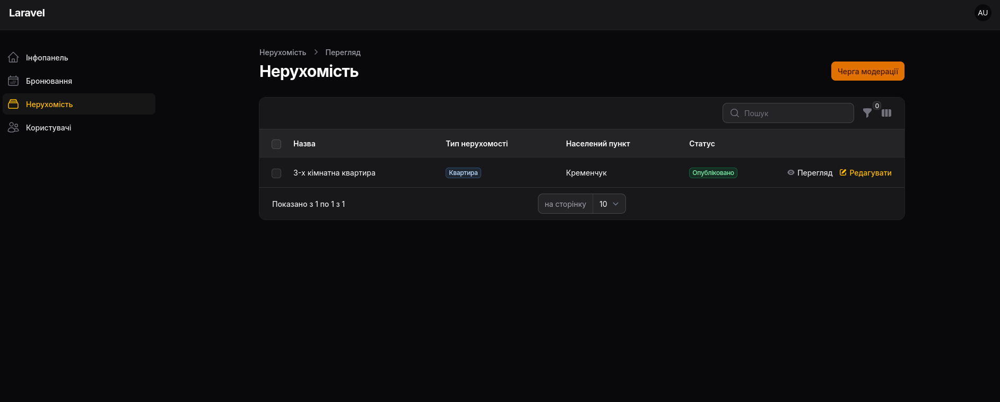
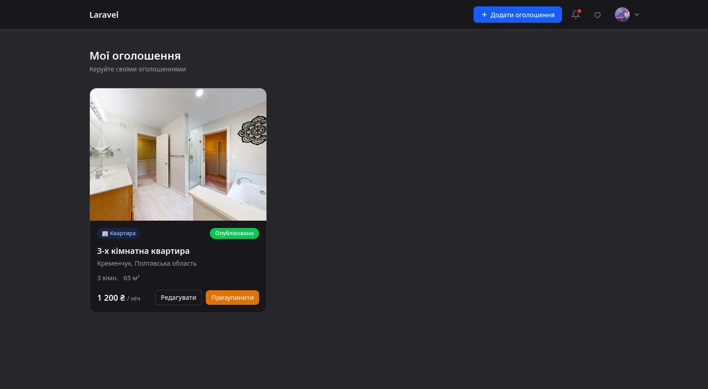

# Room Rentals

Веб додаток для оренди житла на Laravel + Livewire +  Filament.

## Опис проєкту

Це додаток для взаємодії орендарів і власників житла:
- орендарі переглядають оголошення, бронюють житло, та залишають оцінку
- власники керують запитами на бронювання
- адміністратори працюють через адмін панель

## Основні можливості

- Каталог житла та сторінка детального перегляду житла
- Реєстрація, вхід і особистий кабінет користувача
- Створення бронювання для авторизованих користувачів
- Real-time сповіщення
- Кабінет орендаря з можливістю запиту на скасування та залишення відгуку
- Кабінет власника для підтвердження/відхилення бронювань
- Адмін панель для адміністрації проєкту

## Вигляд веб системи






## Технології

- PHP 8.3+
- Laravel 12
- Livewire 3
- Filament 4
- MySQL
- Vite + Tailwind CSS
- Laravel Reverb (broadcast/websocket)

## Приклади роботи

### 1) Сценарій орендаря

1. Зареєструватись та увійти в акаунт
2. Відкрити головну сторінку (`/`) та обрати об’єкт
3. Перейти на сторінку об’єкта (`/properties/{property}`)
4. Забронювати об'єкт нерухомості на вільний час
5. Очікувати підтвердження або відмови від власника

### 2) Сценарій власника

1. Перейти в `/owner/booking-requests`
2. Підтвердити або відхилити запит на бронювання
3. Переглянути/відредагувати власні оголошення в `/my-properties`

## Вимоги

- PHP `^8.3`
- Composer
- Node.js `18+`
- npm
- MySQL `8+`

## Встановлення та запуск

### Запуск через Docker 
1. Клонувати репозиторій:
```bash
git clone <repo-url>
cd Room-Rentals
```

2. Підготувати `.env`:
```bash
cp .env.example .env
php artisan key:generate
```

3. Перевірити/вказати змінні в `.env` для Docker:
```env
APP_URL=http://localhost
APP_PORT=80

DB_CONNECTION=mysql
DB_HOST=mysql
DB_PORT=3306
DB_DATABASE=room-rentals
DB_USERNAME=room-rentals
DB_PASSWORD=room-rentals

FORWARD_DB_PORT=3306

BROADCAST_CONNECTION=reverb
REVERB_APP_ID=room-rentals
REVERB_APP_KEY=room-rentals-key
REVERB_APP_SECRET=room-rentals-secret
REVERB_HOST=localhost
REVERB_PORT=8080
REVERB_SCHEME=http

VITE_REVERB_APP_KEY="${REVERB_APP_KEY}"
VITE_REVERB_HOST="${REVERB_HOST}"
VITE_REVERB_PORT="${REVERB_PORT}"
VITE_REVERB_SCHEME="${REVERB_SCHEME}"

MAIL_MAILER=smtp
MAIL_SCHEME=null
MAIL_HOST=mailpit
MAIL_PORT=1025
MAIL_USERNAME=null
MAIL_PASSWORD=null
MAIL_FROM_ADDRESS=no-reply@room-rentals.local
MAIL_FROM_NAME="${APP_NAME}"

FORWARD_MAILPIT_PORT=1025
FORWARD_MAILPIT_DASHBOARD_PORT=8025
```

4. Запустити контейнери:
```bash
docker compose up -d
```

5. Виконати міграції і сидер:
```bash
docker compose exec room-rentals-app php artisan migrate
docker compose exec room-rentals-app php artisan db:seed --force
```

6. Доступні сервіси:
- Застосунок: `http://localhost`
- Mailpit UI(для підвтерждення почти): `http://localhost:8025`

### Локальний запуск (без Docker)

1. Встановити залежності:
```bash
composer install
npm install
```

2. Підготувати `.env`:
```bash
cp .env.example .env
php artisan key:generate
```

3. Вказати змінні БД у `.env` (для локального MySQL):
```env
DB_CONNECTION=mysql
DB_HOST=127.0.0.1
DB_PORT=3306
DB_DATABASE=room-rentals
DB_USERNAME=room-rentals
DB_PASSWORD=room-rentals
```

4. Запустити міграції:
```bash
php artisan migrate
```

5. Запустити проєкт у dev-режимі:
```bash
php artisan reverb:start
php artisan queue:work
composer dev
```

Після запуску застосунок буде доступний за адресою `http://localhost:8000`.

## Збирання

```bash
npm run build
composer install --no-dev --optimize-autoloader
php artisan migrate --force
php artisan config:cache
php artisan route:cache
php artisan view:cache
```

## Ліцензія

Проєкт розповсюджується за ліцензією [MIT](LICENSE).
